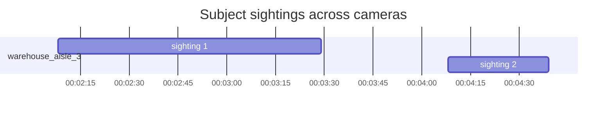

<!-- SPDX-FileCopyrightText: Copyright (c) 2026 NVIDIA CORPORATION & AFFILIATES. All rights reserved. -->
<!-- SPDX-License-Identifier: Apache-2.0 -->

# Track Subject Across Cameras

Orchestrates `video-search` + Elasticsearch KNN re-ID + `vios` + `video-summarization` (VLM-direct path) to produce a unified timeline of a specific subject's movements across cameras. Re-identification uses the subject's behavior embedding so the timeline follows the same physical person/object, not just "anyone matching the description".

**User interaction pattern (important for chat surfaces like Slack):** the whole workflow surfaces to the user only at two moments — (1) the one-at-a-time candidate confirmation in Step 1, and (2) the final timeline output in Step 8. Everything in between (embedding fetch, KNN, window merge, clip fetch, VLM, filtering) runs silently. Do not post progress updates or intermediate results between those two moments.

## Inputs

Subject description (required) plus optional filters (`top_k`, `video sources`, `similarity_threshold`), all parsed from the natural-language query. See the `video-search` skill for fusion-search axes. `similarity_threshold` (default **0.9**) controls the KNN cutoff in Step 3.

## Endpoint resolution

Ask once at the start, cache for the run:
- **Search agent** — host URL (local or remote)
- **Elasticsearch** — same host as search agent, port `9200`
- **VST** — inferred from `screenshot_url` in search results, no config needed
- **VLM** — same VLM the search deployment uses (so descriptions match the critic). Order: `VLM_BASE_URL` env → deploy's `.env` → ask user. Never silently fall back to a different VLM

---

## Workflow

### 1. Fusion search → one-at-a-time user confirmation

Call `video-search` with the subject description and `top_k` (default 5). Do **not** dump the full candidate list at the user — that's noisy in chat surfaces like Slack. Instead, walk the top hits one at a time until the user confirms.

For each candidate in similarity order:
1. Fetch a short overlay clip via `vios` (clip-URL-with-overlay variant, `configuration.overlay.bbox` with `objectId` set to the hit's `object_ids`, `showObjId: true`). See `vios` skill for the exact request.
2. Post one message: the overlay clip embedded or linked, plus **"Is this the subject you want tracked? (yes/no)"**. Nothing else.
3. If **yes** → save the selected hit's `(video_name, object_id, start_time, end_time)` and proceed silently to Step 2. Do not narrate intermediate progress. The next message to the user should be the final timeline output from Step 8.
4. If **no** → move to the next candidate and repeat. If all `top_k` exhausted, tell the user "no more candidates, refine the description" and stop.

Extract the VST host from any `screenshot_url` — reuse it later for clip URL fetches.

### 2. Fetch the seed behavior embedding

The seed's embedding lives in `mdx-behavior-*` — one doc per tracked object appearance, with a 1536-dim nested `embeddings.vector`. Pin to the exact `(video_name, object_id, time window)` — do **not** query by `object_id` alone (ids are reused across sensors).

```bash
cat > /tmp/seed_query.json <<'JSON'
{
  "size": 1,
  "query": {
    "bool": {
      "filter": [
        { "term":  { "sensor.id.keyword": "<video_name>" } },
        { "term":  { "object.id.keyword": "<object_id>" } },
        { "range": { "timestamp": { "gte": "<selected start>", "lte": "<selected end>" } } }
      ]
    }
  },
  "_source": ["sensor.id", "object.id", "timestamp", "end", "embeddings.vector"]
}
JSON
curl -s -X POST "<es-endpoint>/mdx-behavior-*/_search" -H "Content-Type: application/json" -d @/tmp/seed_query.json
```

Extract `hits[0]._source.embeddings[0].vector` → save to `/tmp/seed_vec.json`. If `embeddings` is empty or missing, treat as "no seed available" — see fallback below.

> **Behavior-only, not raw.** `mdx-raw-*` has per-frame detections which are too noisy as seeds. Behavior events are already condensed by object-tracking and give one stable embedding per appearance window.

> **If zero matches or no embedding** — the behavior pipeline may not have produced an event for this object yet (raw detection alone isn't enough). Offer: (a) pick a different candidate from Step 1 that does have behavior coverage, or (b) skip the re-ID expansion and build the timeline from only the Step 1 candidates.

### 3. KNN similarity search on `mdx-behavior-*`

Use the seed vector, apply the `video sources` filter from the original query if any, use `min_score` as the cutoff.

```bash
cat > /tmp/build_knn.py <<'PY'
import json
v = json.load(open("/tmp/seed_vec.json"))
body = {
    "knn": {
        "field": "embeddings.vector",
        "query_vector": v,
        "k": 500,
        "num_candidates": 1000,
        # Carry over video sources from original query; omit to search all sensors
        "filter": [
            { "terms": { "sensor.id.keyword": ["<video_name_1>", "<video_name_2>"] } }
        ]
    },
    "min_score": 0.9,   # similarity_threshold; 1.0 = self-match, 0.9+ = same subject, 0.8–0.9 = same subject but short/noisy tracks, <0.8 = likely different
    "_source": ["sensor.id", "object.id", "timestamp", "end"],
    "size": 500
}
json.dump(body, open("/tmp/knn_body.json", "w"))
PY
python3 /tmp/build_knn.py
curl -s -X POST "<es-endpoint>/mdx-behavior-*/_search" -H "Content-Type: application/json" -d @/tmp/knn_body.json
```

The seed's self-match returns `score=1.0` — keep it. Each hit has `timestamp` (start), `end`, `sensor.id` (= video_name), `object.id`. Emit `(video_name, object_id, start_time, end_time, similarity)` tuples.

> **Map `video_name` → VST sensor UUID** once before the next step: `GET http://<vst-host>/vst/api/v1/sensor/list` → match `name == video_name` → use its `sensorId`. `vios` needs the UUID, not the video name.

### 4. Group overlapping windows per sensor

Merge two windows **only if** same `sensor_id` AND time ranges overlap or are directly adjacent.

- Same sensor `[0:00–0:30]` + `[0:20–0:45]` → merge
- Same sensor `[0:00–0:30]` + `[2:00–2:30]` → **do not merge** (gap)
- Different sensors → **never merge** (those are simultaneous observations)

Merging non-intersecting windows creates fake ranges and pulls back unrelated footage — do not do it.

### 5. Fetch clip URLs (via `vios`)

For each merged `(sensor_id, start, end)`:

```bash
curl -s "http://<vst-host>/vst/api/v1/storage/file/<sensor_id>/url?startTime=<start>&endTime=<end>&container=mp4&disableAudio=true" | python3 -m json.tool
```

Save the returned `videoUrl` tied to its `(sensor_id, start, end, video_name)` tuple — carry through Steps 6–7. Verify the response's `streamId` matches the requested `sensor_id`; discard any row where the returned `startTime` differs from the requested one by more than a few seconds.

### 6. VLM analysis per clip

Defer to the **`video-summarization` skill's direct-VLM path** for each `videoUrl`. Force VLM, not LVS — the summarization skill routes ≥60s videos to LVS by default, but timeline needs per-clip VLM output consistent with the search critic.

Prompt (substitute `<subject>`; broaden narrow color terms, e.g. `green vest` → `hi-vis safety vest (green/yellow/lime)` — the VLM names the same fluorescent vest differently across camera angles):

```
Focus only on <subject>. For this clip:
1. If the subject is NOT present, respond with exactly: SUBJECT NOT FOUND
2. Otherwise describe what they do, where they move, and what they interact with. Note timing (e.g. "at 5s", "from 10–15s").
```

### 7. Filter mismatches

Discard `SUBJECT NOT FOUND` responses. If rejection rate is high, the prompt was likely too strict on attribute terms, not an identity mismatch — loosen per Step 6's note.

### 8. Synthesize output

Produce three sections, ordered chronologically by `start_time`.

#### 8a. Gantt chart (PNG + inline renders)

Install matplotlib once if missing:
```bash
python3 -c "import matplotlib" 2>/dev/null || pip install --quiet --break-system-packages matplotlib
```

Build `/tmp/timeline_sightings.json` (list of `{sensor, start, end}`), then run:

```bash
cat > /tmp/timeline_chart.py <<'PY'
import json, matplotlib.pyplot as plt, matplotlib.dates as mdates
from datetime import datetime
sightings = json.load(open("/tmp/timeline_sightings.json"))
sensors = sorted({s["sensor"] for s in sightings})
fig, ax = plt.subplots(figsize=(12, max(2, 0.5*len(sensors)+1)))
for s in sightings:
    start = datetime.fromisoformat(s["start"].replace("Z","+00:00"))
    end   = datetime.fromisoformat(s["end"].replace("Z","+00:00"))
    ax.barh(sensors.index(s["sensor"]), end-start, left=start, height=0.6,
            color="#4a90e2", edgecolor="#1f4e8c")
ax.set_yticks(range(len(sensors))); ax.set_yticklabels(sensors)
ax.xaxis.set_major_formatter(mdates.DateFormatter("%H:%M:%S"))
ax.set_xlabel("Time (UTC)"); ax.set_title("Subject sightings across cameras")
ax.grid(axis="x", linestyle=":", alpha=0.5); plt.tight_layout()
plt.savefig("/tmp/subject_timeline.png", dpi=120)
PY
python3 /tmp/timeline_chart.py
```

**Embed the PNG as base64 markdown in the chat reply** so it renders inline in the OpenClaw UI (a bare file path doesn't):
```python
import base64
b64 = base64.b64encode(open("/tmp/subject_timeline.png","rb").read()).decode()
# include in reply: 
```

**Also emit a Mermaid Gantt block inline** (second fallback if base64 decode fails):

````markdown

````

One `section` per sensor; one `<label> :<id>, <ISO-start>, <duration>s` per merged window.

#### 8b. Detail table

| Time (UTC) | Sensor | VLM analysis | Proof |
|---|---|---|---|
| `start–end` | `video_name` | 1–2 sentences from Step 6 | [clip](videoUrl) · [frame](screenshot_url) |

One row per surviving clip. Keep VLM analysis concise.

#### 8c. Trajectory summary

Combine all per-clip VLM captions into one flowing narrative (paragraph, not bullets). Cover: entry, chronological path across sensors, actions per location, simultaneous multi-camera observations, dwell / repeat visits, notable interactions, exit. Someone reading only the summary should understand the full trajectory.

Save everything (chart + table + summary) to `/tmp/subject_timeline.md`, and render the base64 PNG + Mermaid + summary inline in the chat reply.

---

## Tips

- **similarity_threshold** — 0.9 default. <0.9 includes more track fragments, >0.95 risks dropping real distant sightings
- **Cluster fragmented tracks** — after Step 4's strict merge, also combine same-sensor windows within ~30s to avoid N VLM calls on one real appearance that got split into micro-tracks by tracker resets
- **Sparse behavior coverage** — if KNN returns only the self-match, skip re-ID and use Step 1 candidates
- **Simultaneous observations** across sensors are valuable — keep all
- **Time format** — ISO 8601 UTC, keep the `Z`

## Related skills

- `video-search` — Step 1 (fusion search, user selection)
- `vios` — Step 5 (clip URL from sensor UUID + time range)
- `video-summarization` — Step 6 (VLM-direct path, not LVS)
- `deploy` — provides `ELASTIC_SEARCH_PORT` and `VLM_BASE_URL` for the active deployment
